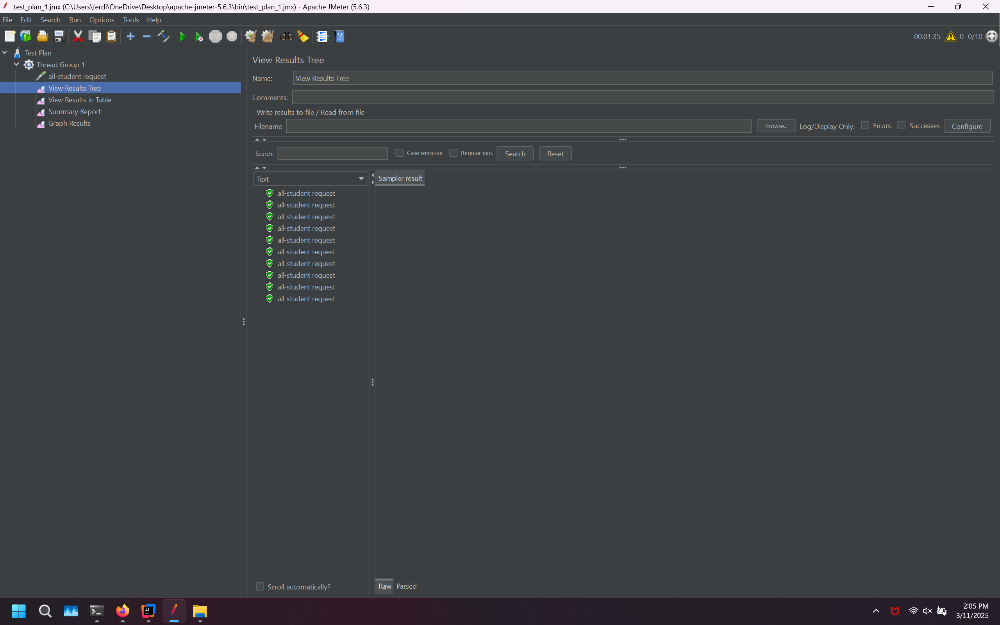
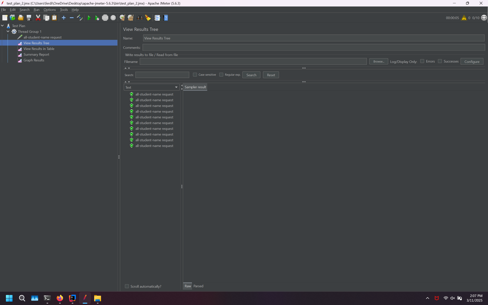
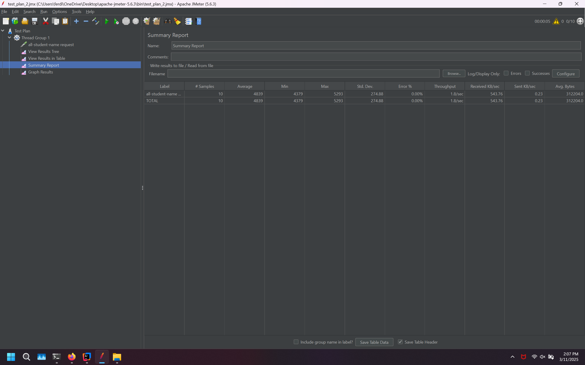
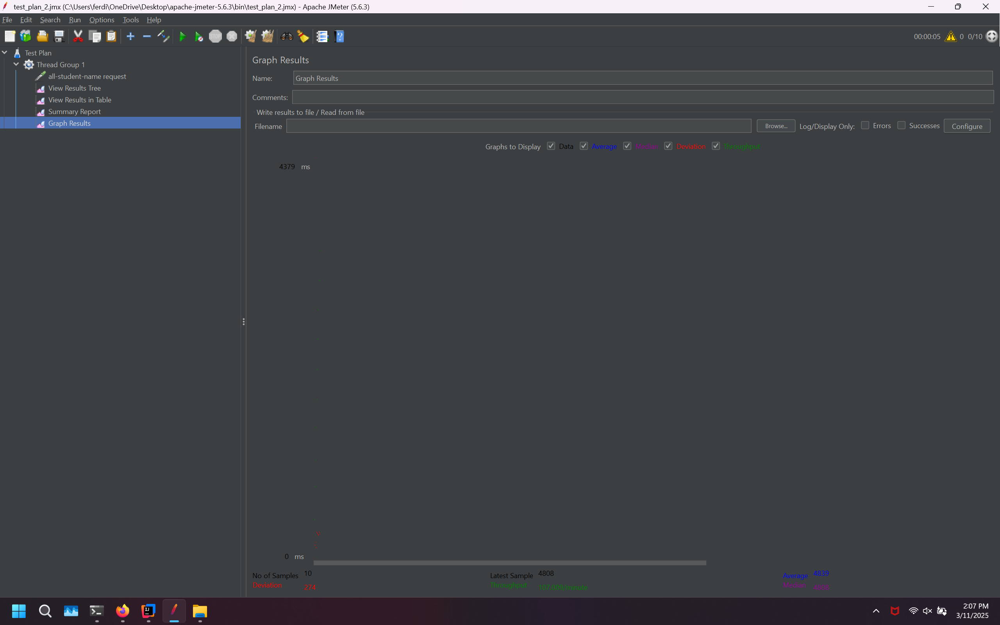
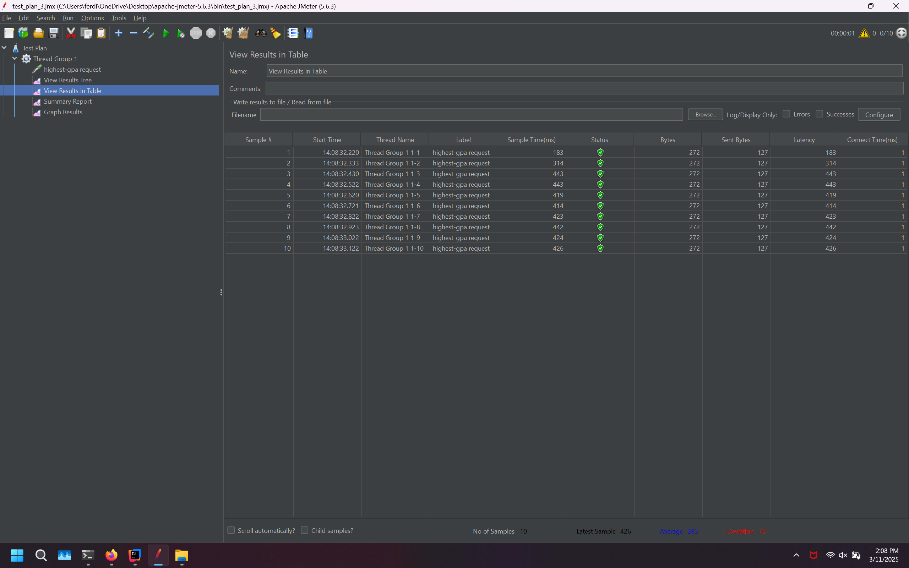
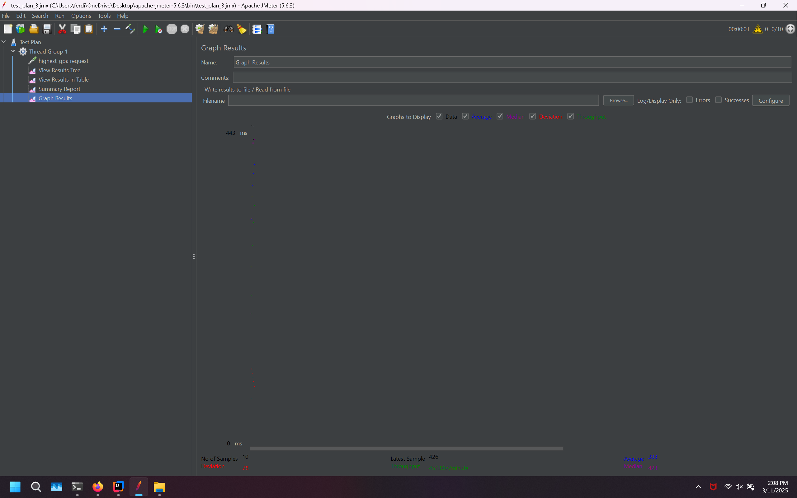
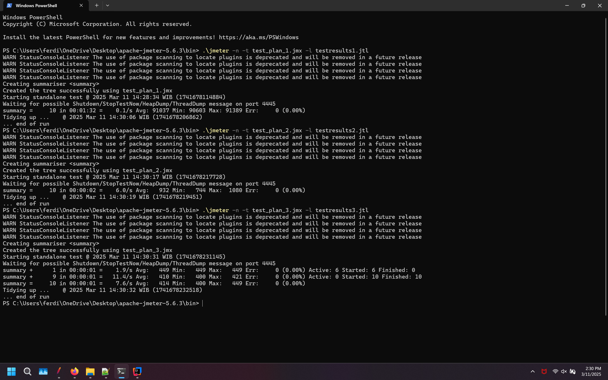
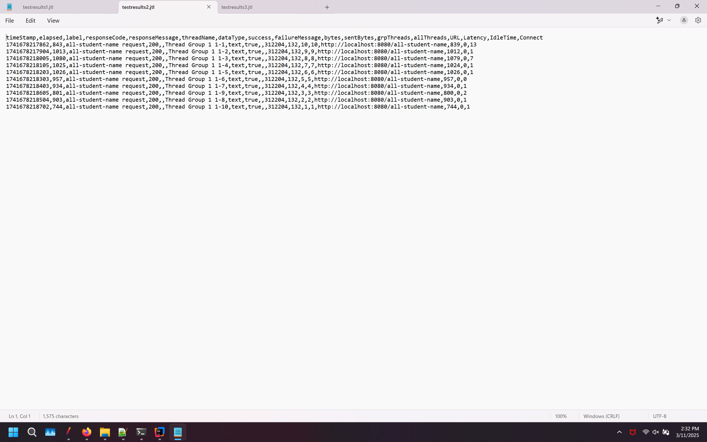
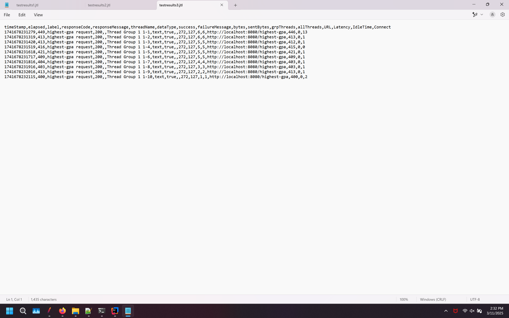

# /all-student

### test1ResultsTree

### test1ResultsTable

### test1SummaryReport

### test1GraphResults

# /all-student-name

### test2ResultsTree

### test2ResultsTable

### test2SummaryReport

### test2GraphResults

# /highest-gpa

### test3ResultsTree

### test3ResultsTable

### test3SummaryReport

### test3GraphResults

# using command line

### /all-student testresults1.jtl

### /all-student-name testresults2.jtl

### /highest-gpa testresults3.jtl

