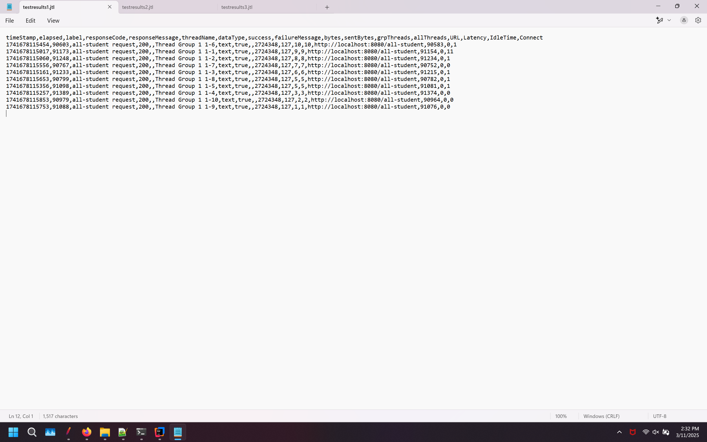
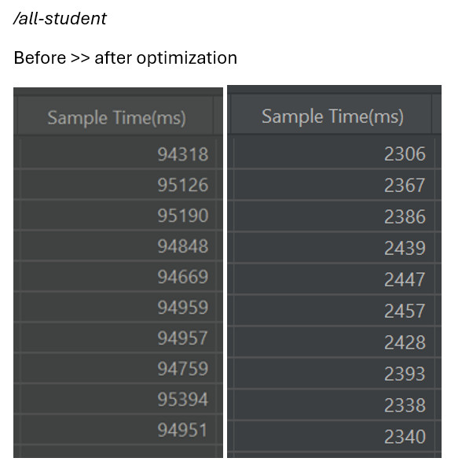

# /all-student

### test1ResultsTree

### test1ResultsTable

### test1SummaryReport

### test1GraphResults

# /all-student-name

### test2ResultsTree

### test2ResultsTable

### test2SummaryReport

### test2GraphResults

# /highest-gpa

### test3ResultsTree

### test3ResultsTable

### test3SummaryReport

### test3GraphResults

# using command line

### /all-student testresults1.jtl

### /all-student-name testresults2.jtl

### /highest-gpa testresults3.jtl

# Comparison before optimised and after optimised
Is there improvement in JMeter measurements? yes, a lot of improvements

# Reflection

### 1. What is the difference between the approach of performance testing with JMeter and profiling with IntelliJ Profiler in the context of optimizing application performance?

JMeter allows us to run more than 1 process simultaneously, this in turn allows us to know the average running time of our code, but JMeter doesn't show us which part of the code slows our program down. On the other hand, IntelliJ Profiler shows us which part of the code that takes too much time and in turn slows the program down, on the cost that we have to run each profiler individually. In conclusion, JMeter is better used to find out our program average time, and IntelliJ profiler is better used to find out which part of our program need optimising.

### 2. How does the profiling process help you in identifying and understanding the weak points in your application?

The profiling process in IntelliJ gives me more insight of what the process of my code is like and how long each process take. I'm especially helped with the Flame Graph feature where I can see which method consumed the most time and therefore I should optimise further.

### 3. Do you think IntelliJ Profiler is effective in assisting you to analyze and identify bottlenecks in your application code?

Yes, very much so. Although it can be hard to read sometimes, IntelliJ Profiler Flame Graph and Method List feature really helps when trying to find out which method takes the most time to run and consequently needs optimising. The cherry on top is it shows the running time of aforementioned method in the code editor, allowing me to know how much I optimise the code without having to look at the profiler tab.

### 4. What are the main challenges you face when conducting performance testing and profiling, and how do you overcome these challenges?

My main challenges so far when conducting performance testing and profiling is to actually optimise the method need optimising themselves, and I overcome that just by practising more and talking to a programming duck. I admit I have some problem in the early phases of performance testing and profiling because I am not used to the software used, but I overcome that easily with experience.

### 5. What are the main benefits you gain from using IntelliJ Profiler for profiling your application code?

Like I have said before, the main benefits of using IntelliJ profiler is the existence of Flame Graph, Method List, and in code editor time indicator. The Flame Graph allows me to identify slow part of the code, the Method List allows me to get more insight of how badly the slow-down is by the code, and the in code editor time indicator allows me to optimise the method and look on how much I optimise it without going back and forth through Flame Graph and Method List.

### 6. How do you handle situations where the results from profiling with IntelliJ Profiler are not entirely consistent with findings from performance testing using JMeter?

I quietly sighed, close JMeter, focus on results from profiling with IntelliJ Profiler the best I can, and after I'm done optimising, I close the profiler, open JMeter and compare past JMeter measurements and current JMeter measurements. My understanding is JMeter and IntelliJ Profiler is two different software, therefore it is not fair to assume both use the same way to compute time used on a program.

### 7. What strategies do you implement in optimizing application code after analyzing results from performance testing and profiling? How do you ensure the changes you make do not affect the application's functionality?

At the beginning I use IntelliJ Profiler to find which method is taking a long time to run. After isolating our bottleneck, I analyze what the method do and what they return. And then I remake the method with my optimisation whilst making sure it does and return the same thing as the original method but in a more efficient way. I also can make sure the changes I make does not affect the application functionality by swapping the optimised and non-optimised method and making sure both output the same results.
